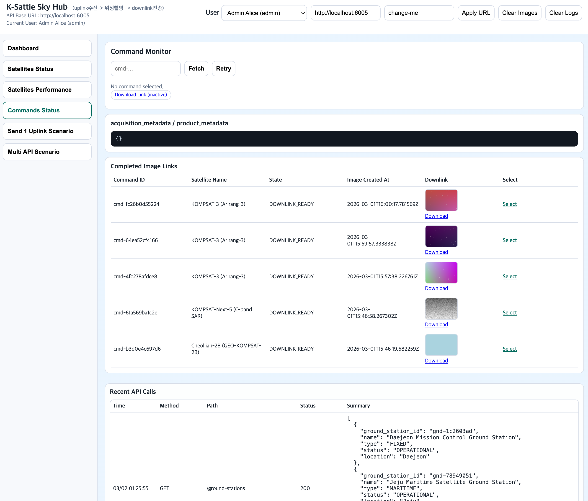

# K-Sattie Sky Hub

This service simulates a satellite that:
- receives uplink commands from a ground station,
- captures an image based on satellite type,
- and provides a downloadable downlinked image.

## Console Snapshot



## Features

- `POST /satellites`: register virtual satellites (`satellite_id(optional)`, `name`, `type`, `status`)
- `PATCH /satellites/{satellite_id}`: update satellite name/type/status
- `DELETE /satellites/{satellite_id}`: delete satellite
- `POST /seed/mock-satellites`: create baseline mock satellites
- `POST /ground-stations`: create ground station (`ground_station_id(optional)`, `name`, `type`, `status`, `location`)
- `POST /seed/mock-ground-stations`: create ready-to-use mock ground stations
- `POST /seed/mock-requestors`: create ready-to-use mock requestors per ground station
- `GET /ground-stations`: list available mock ground stations
- `PATCH /ground-stations/{ground_station_id}`: update ground station
- `DELETE /ground-stations/{ground_station_id}`: delete ground station
- `GET /satellite-types`: view type profiles used for mock response fields
- `GET /scenarios`: list baseline scenario catalog (`SCN-001`~`SCN-012`)
- `POST /uplink`: send command to a satellite
- `GET /commands`: list command statuses
- async state transitions:
  - `QUEUED -> ACKED -> CAPTURING -> DOWNLINK_READY`
  - or `FAILED`
- type-based image generation:
  - `EO_OPTICAL`: pseudo RGB image with cloud noise
  - `SAR`: grayscale image with speckle noise
  - `EXTERNAL`: map tile-based image from AOI center/bbox (OSM demo mode)
- `GET /commands/{command_id}`: command status
- `POST /commands/{command_id}/rerun`: rerun failed command with same command id
- `GET /downloads/{command_id}`: download generated PNG
- `POST /downloads/{command_id}/save-local`: save download metadata to server local path
- `POST /images/clear`: clear generated images and unlink from commands
- `GET /preview/external-map`: preview OSM map image from AOI center before uplink

Seed baseline notes:
- `POST /seed/mock-satellites` now creates 15 baseline satellites with English-model-based IDs.
  - examples: `KOMPSAT-3`, `KOMPSAT-3A`, `GK-2A`, `425-PROJECT-1`, `CAS500-2`, `NEONSAT`
- Satellite response includes baseline metadata:
  - `internal_satellite_code`, `eng_model`, `domain`, `resolution_perf`, `baseline_status`, `primary_mission`
- Runtime status defaults to `AVAILABLE` for simulation flow, while official lifecycle is kept in `baseline_status`.
- Ground station response includes:
  - `ground_station_id` (external alias ID)
  - `internal_ground_station_code` (internal code)
- Ground station alias IDs are auto-generated by pattern (region + initials), e.g. `DAE-MC`, `JEJ-M`, `INC-AR`.
- Name duplicates are blocked for satellites and ground stations (`409`).
- Startup auto-seed is enabled by default:
  - `SATTI_AUTO_SEED_ON_STARTUP=1` (default)
  - set `SATTI_AUTO_SEED_ON_STARTUP=0` to disable

Console multi-scenario runner is aligned to baseline `SCN-001`~`SCN-012`.

## Quick Start

```bash
./one-shot-startup.sh
```

Server runs on `http://127.0.0.1:6005`.
Validation console runs at `http://127.0.0.1:6005/`.

Stop:

```bash
./one-shot-stop.sh
```

Console tabs:
- `Dashboard`
- `Satellites`
- `Satellites Performance`
- `Payload Monitoring`
- `Diagnostics` (default collapsed)
  - `Send A Uplink`
  - `Multi Payload Scenario`
  - `Commands Monitor`

## Console Role Mode (Mock)

The web console has mock user mode for UI authorization checks:

- `admin`: full menu and full management actions (satellite/ground-station/requestor create/update/delete/seed)
- `operator`: no access to `Satellites` menu and management actions are blocked in UI (returns simulated `403`)
- `requestor`: access only `Dashboard`, `Satellites Performance`, `Payload Monitoring`/`Commands Monitor` read flows

Mock users are switchable from header dropdown and the selected user is persisted in local storage (`simMockUserId`).

## Security Defaults

API is protected by default.

- Header: `x-api-key`
- Default key: `change-me` (set `SATTI_API_KEY` in production)
- Rate limit: `600` requests/minute per IP (set `SATTI_RATE_LIMIT_PER_MIN`)
  - Local test: `SATTI_RATE_LIMIT_PER_MIN=0` to disable
- CORS allowlist: `http://localhost:6005,http://127.0.0.1:6005` (set `SATTI_ALLOWED_ORIGINS`)

Example:

```bash
SATTI_API_KEY='your-strong-key' uvicorn app.main:app --reload --port 6005
```

Recommended production run:

```bash
SATTI_API_KEY='your-strong-key' \
SATTI_ALLOWED_ORIGINS='https://your-ui-domain' \
./venv/bin/uvicorn app.main:app --host 0.0.0.0 --port 6005
```

Public paths:
- `/health`, `/`, `/docs`, `/redoc`, `/openapi.json`

Protected paths:
- All other operational APIs require `x-api-key`.

## Client Integration Guide

### Required request header

All protected APIs must include:

```http
x-api-key: <your-api-key>
```

If omitted or invalid:
- `401 Unauthorized`

If too many requests:
- `429 Too Many Requests`

### Recommended API flow for clients

1. `POST /seed/mock-satellites` (optional for test initialization)
2. `POST /seed/mock-ground-stations` (optional for test initialization)
3. `POST /seed/mock-requestors` (optional; auto-run in console bootstrap when stations exist and no requestor exists)
4. `GET /satellites` (choose `satellite_id`)
5. `GET /ground-stations` (choose external alias `ground_station_id`)
6. `GET /requestors?ground_station_id=...` (choose requestor for selected ground station)
7. `POST /uplink` (store returned `command_id`)
8. `GET /commands/{command_id}` polling until `DOWNLINK_READY` or `FAILED`
9. Read `download_url` from command response when ready
10. `GET /downloads/{command_id}` using header auth or browser query auth

### Retry model (failed or missing-downlink command)

- `Fetch` in UI: query current command state
- `Retry` in UI: rerun a failed command using same `command_id`
- API: `POST /commands/{command_id}/rerun`
- Rerun is allowed when:
  - `state == FAILED`
  - or command was `DOWNLINK_READY` but downlink file is missing (auto-normalized to `FAILED`)
- Other states return `409`.

### Download link behavior

- `POST /uplink` response does not include a ready file link yet.
- `download_url` appears only when:
  - `state == DOWNLINK_READY`
  - generated image file actually exists on server
- If a command is `DOWNLINK_READY` but file is missing (manual deletion/clear),
  server auto-normalizes the command to `FAILED` with a missing-file message.
- If not ready, `GET /downloads/{command_id}` returns `409`.
- If command/file does not exist, returns `404`.

Browser-friendly download:

- Browsers opening a plain link cannot always attach `x-api-key`.
- For UI links, use query auth:
  - `/downloads/{command_id}?api_key=<SATTI_API_KEY>`

### Business-grade uplink fields

The uplink payload supports business-oriented tasking inputs:

- Uplink requester:
  - `ground_station_id` (optional, but recommended for traceability)
  - `requestor_id` (optional; when provided, must belong to the selected `ground_station_id`)
- AOI geometry:
  - `aoi_center_lat`, `aoi_center_lon`
  - `aoi_bbox` (`[minLon,minLat,maxLon,maxLat]`)
- Time window:
  - `window_open_utc`, `window_close_utc` (ISO8601 UTC)
- Priority:
  - `priority` (`BACKGROUND|COMMERCIAL|URGENT`)
- EO constraints:
  - `max_cloud_cover_percent`
  - `max_off_nadir_deg`
  - `min_sun_elevation_deg`
- SAR constraints:
  - `incidence_min_deg`, `incidence_max_deg`
  - `look_side` (`ANY|LEFT|RIGHT`)
  - `pass_direction` (`ANY|ASCENDING|DESCENDING`)
  - `polarization` (e.g. `VV`, `VH`)
- Delivery:
  - `delivery_method` (`DOWNLOAD|S3|WEBHOOK`)
  - `delivery_path` (required for `S3`/`WEBHOOK`)
- Generation mode (simulator-only optional fields):
  - `generation_mode` (`INTERNAL|EXTERNAL`)
  - `external_map_source` (`OSM`)
  - `external_map_zoom` (`1~19`)

### External map mode notes (business review)

- Current implementation supports `EXTERNAL + OSM` for prototype/testing.
- For production/commercial usage, use a contracted map imagery provider or self-hosted tiles.
- Public OSM tile endpoints are policy-constrained and can be blocked under heavy/commercial use.

## API Example

0) Auto seed on startup

By default, server startup auto-runs:
- `seed/mock-satellites`
- `seed/mock-ground-stations`
- `seed/mock-requestors`

Disable with `SATTI_AUTO_SEED_ON_STARTUP=0`.

1) Seed mock satellites (manual):

```bash
curl -s -X POST http://127.0.0.1:6005/seed/mock-satellites \
  -H 'x-api-key: change-me'
```

2) Seed mock ground stations:

```bash
curl -s -X POST http://127.0.0.1:6005/seed/mock-ground-stations \
  -H 'x-api-key: change-me'
```

3) Seed mock requestors:

```bash
curl -s -X POST http://127.0.0.1:6005/seed/mock-requestors \
  -H 'x-api-key: change-me'
```

4) Check satellite list with profiles:

```bash
curl -s http://127.0.0.1:6005/satellites \
  -H 'x-api-key: change-me'
```

5) Check ground station list:

```bash
curl -s http://127.0.0.1:6005/ground-stations \
  -H 'x-api-key: change-me'
```

6) Check requestor list for a ground station:

```bash
curl -s "http://127.0.0.1:6005/requestors?ground_station_id=DAE-MC" \
  -H 'x-api-key: change-me'
```

7) Send uplink command:

```bash
curl -s -X POST http://127.0.0.1:6005/uplink \
  -H 'x-api-key: change-me' \
  -H 'Content-Type: application/json' \
  -d '{
    "satellite_id":"KOMPSAT-3",
    "ground_station_id":"DAE-MC",
    "requestor_id":"req-xxxxxxx",
    "mission_name":"harbor-monitoring",
    "aoi_name":"busan-port",
    "width":1024,
    "height":1024,
    "cloud_percent":25,
    "fail_probability":0.05
  }'
```

6) Poll status:

```bash
curl -s http://127.0.0.1:6005/commands/cmd-xxxxxxxxxxxx \
  -H 'x-api-key: change-me'
```

When `state` is `DOWNLINK_READY`, use `download_url`:

```bash
curl -L -o result.png http://127.0.0.1:6005/downloads/cmd-xxxxxxxxxxxx \
  -H 'x-api-key: change-me'
```

Browser link example:

```text
http://127.0.0.1:6005/downloads/cmd-xxxxxxxxxxxx?api_key=change-me
```

## Notes

- Data is in-memory for state tracking.
- Output images are stored under `data/images/`.
- This is an MVP simulator and can be extended with:
  - mission windows/contact windows,
  - retry/escalation policies,
  - persistent DB/event log,
  - realistic AOI-based rendering.
